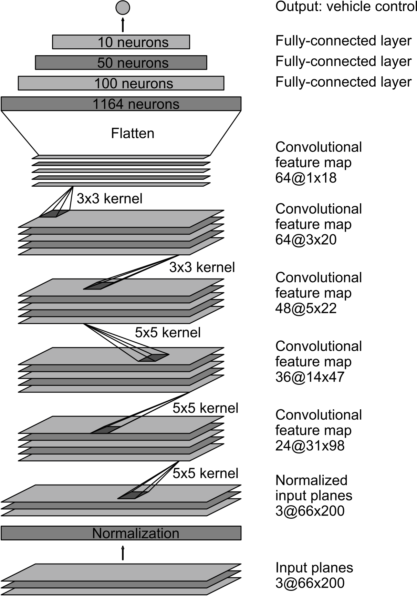

# Behavior Cloning Project

The goals / steps of this project are the following:
* Use the simulator to collect data of good driving behavior
* Build, a convolution neural network in Keras that predicts steering angles from images
* Train and validate the model with a training and validation set
* Test that the model successfully drives around track one without leaving the road
* Summarize the results with a written report

## Files Submitted and Code Quality
### Submission includes all required files
My project includes the following files:
* model.py containing the script to load, preprocess data and create, train the model
* drive.py for driving car in autonomous mode - increased the desired speed to 30 mph
* model.h5 contains a trained neural network model
* writeup_report.md summaries the result
### Driving car in autonomous mode
I have modified the original drive.py to increase the desired speed to 30. The below command uses to drive the car in autonomous mode
```sh
python drive.py model.h5
```
### The data preprocessing, model creating and training - model.py
#### Data loading and preprocessing
I have collected many different data for training such as clockwise, counterclockwise, curve, recovery on track 1 and some on track 2, so I need to implement the data loading function in order to load all sub directory of data folder and merge it together. It helps me to test easier with different data approach by doing copy the captured data to the data folder.
```python
# Load data from one folder
def load_data(data_folder):
    results = []
    steerings = []
    with open(data_folder + '/driving_log.csv') as csvfile:
        reader = csv.reader(csvfile)
        for line in reader:
            # center image
            center_image_path = data_folder + '/IMG/' + line[0].split('\\')[-1]
            line[0] = center_image_path
            left_image_path = data_folder + '/IMG/' + line[1].split('\\')[-1]
            line[1] = left_image_path
            right_image_path = data_folder + '/IMG/' + line[2].split('\\')[-1]
            line[2] = right_image_path
            results.append(line)
            steerings.append(float(line[3]))
    return results, steerings
            
# Loop all sub folders of the data folder, load all driving_log.csv and merge it together for the total data
def load_all_data():
    lines = []
    steerings = []
    for f in listdir('./data'):
        results, steers = load_data('./data/' + f)
        lines += results
        steerings +=  steers
    return lines, steerings
```
The augment_data() function loads the left, right and center camera images and correct the angle with the correction. It also try to flip the captured images on the curve street in order to balance the dataset distribution.
```python
# Use the left and right camera images with the correction.
# If the center angle is bigger than 0.05 (the car is going on the curve), flip the images to increase the data on the curve street.    
def augment_data(lines, steerings, correction=0.22):
    image_paths = []
    angles = []
    for line, steering in zip(lines, steerings):
        # Insert center image path and steer
        center_angle = float(line[3])
        image_paths.append(line[0])
        angles.append(center_angle)
        
        # Left camera image
        left_angle = center_angle + correction
        image_paths.append(line[1])
        angles.append(left_angle)
        
        # Right camera image
        right_angle = center_angle - correction
        image_paths.append(line[2])
        angles.append(right_angle)
        
        # Flip the images if the camera does not capture the straight forward image (angle < 0.05
        if center_angle >= 0.05:
            # flip center image
            image_paths.append(FLIP + line[0])
            angles.append(center_angle*-1.0)
            
            # flip left camera image
            image_paths.append(FLIP + line[1])
            angles.append(left_angle*-1.0)
            
            # flip right camera image
            image_paths.append(FLIP + line[2])
            angles.append(right_angle*-1.0)
    return image_paths, angles
```
The input images are normalized with the Lamda layer, it will also make sure the model will normalize input images when making predictions in drive.py
```python
ch, row, col = 3, 160, 320
model = Sequential()
# Preprocess incoming data, centered around zero with small standard deviation 
model.add(Lambda(lambda x: x/127.5 - 1.,
input_shape=(row, col, ch),
output_shape=(row, col, ch)))
```
The Keras Cropping2D is used for cropping the input images in order to remove some unuseful information on the top and bottom such as tree, sky, hill and the hood of the car.
```python
model.add(Cropping2D(cropping=((60,20),(0,0))))
```
#### Generators
In order to reduce the memory when working with a lot of data, I followed the Udacity lession to implement the generator function as below.
```python
# Generate a batch data with batch size - reference to Udacity lession in order to reduce the processing memory with a lot of data
def generator(image_paths, angles, batch_size=128):
    num_samples = len(image_paths)
    while 1: # Loop forever so the generator never terminates
        shuffle(image_paths, angles)
        for offset in range(0, num_samples, batch_size):
            batch_samples = image_paths[offset:offset+batch_size]
            batch_angles = angles[offset:offset+batch_size]
      
            images = []
            res_angles = []
            for batch_sample, batch_angle in zip(batch_samples,batch_angles):
                names = batch_sample.split(':')
                if len(names) == 2:
                    name = names[1]
                    image = cv2.imread(name)
                    imgOut = cv2.cvtColor(image, cv2.COLOR_BGR2RGB)
                    image_flip = cv2.flip(imgOut,1)
                    images.append(image_flip)
                else:
                    name = batch_sample
                    image = cv2.imread(name)
                    imgOut = cv2.cvtColor(image, cv2.COLOR_BGR2RGB)
                    images.append(imgOut)            
                res_angles.append(batch_angle)

            # trim image to only see section with road
            X_train = np.array(images)
            y_train = np.array(res_angles)
            yield sklearn.utils.shuffle(X_train, y_train)
```
## Model Architecture and Training Strategy
### Final Model Architecture
The final architecture is following the NVIDIA architecture from the Udacity lession with the change of input size following the captured data.
Here is the visulization of NVIDIA CNN architecture from [NVidia page](https://devblogs.nvidia.com/parallelforall/deep-learning-self-driving-cars/)

The model is implemented in model.py
```python
def NVidea():
    
    ch, row, col = 3, 160, 320
    model = Sequential()
    # Preprocess incoming data, centered around zero with small standard deviation 
    model.add(Lambda(lambda x: x/127.5 - 1.,
            input_shape=(row, col, ch),
            output_shape=(row, col, ch)))
    model.add(Cropping2D(cropping=((60,20),(0,0))))
    model.add(Convolution2D(24,5,5,subsample=(2,2),activation="relu"))
    model.add(Convolution2D(36,5,5,subsample=(2,2),activation="relu"))
    model.add(Convolution2D(48,5,5,subsample=(2,2),activation="relu"))
    model.add(Convolution2D(64,3,3,activation="relu"))
    model.add(Convolution2D(64,3,3,activation="relu"))
    model.add(Flatten())
    model.add(Dense(100))
    #model.add(Dropout(0.5))
    model.add(Dense(50))
    #model.add(Dropout(0.5))
    model.add(Dense(10))
    model.add(Dense(1))
    return model
```
### Solution Design Approach
I have followed the model architecture with udacity sample data from the Udacity Behavior Cloning project lession, it helped get my car run autonomous a short distance. I think the NVIDIA is a good model architecture to apply, so I finnaly choose it.
In order to reduce the overfitting, first of all I tried to apply some Dropout layers after the fully connection layers but it didn't help anymore. The car could not pass on the first curve after bridge with dropout, so I finally don't apply dropout. I have tried to capture mode data and data augmentation as a way to reduce overfitting. I also applied the early stopping and model checkpoint to reduce the training time and get the best model between 15 epoches.
```python
def train_model(image_paths, angles, batch_size=128,nb_epoch=15):
    #train_samples, validation_samples = train_test_split(lines, test_size=0.2)
    train_samples, validation_samples, train_angles, validation_angles = train_test_split(image_paths, angles, test_size=0.2)
    #train_samples, train_angles, validation_samples, validation_angles = train_test_split(image_paths, angles, test_size=0.2)
    # compile and train the model using the generator function
    train_generator = generator(train_samples, train_angles, batch_size=batch_size)
    validation_generator = generator(validation_samples, validation_angles, batch_size=batch_size)
    ch, row, col = 3, 160, 320
    model = NVidea()
    model.compile(loss='mse', optimizer='adam')
    # Apply EarlyStopping
    early_stop = EarlyStopping(monitor='val_loss', patience=3, verbose=0, mode='min')
    # Apply ModelCheckpoint in order to save the model after each epoch, we will choose the best model between epoches
    checkpoint = ModelCheckpoint('model{epoch:02d}.h5')
    model.fit_generator(train_generator, samples_per_epoch= len(train_samples), validation_data=validation_generator, nb_val_samples=len(validation_samples), nb_epoch=nb_epoch, callbacks=[early_stop, checkpoint])
    #model.fit_generator(train_generator, samples_per_epoch= len(train_samples), validation_data=validation_generator, nb_val_samples=len(validation_samples), nb_epoch=nb_epoch)
    model.save('model.h5')
```
I have tried to run the test many times with some different hyper-parameters, model turning and data. The car got some issues when passing the first and second curve after the brige, I tried to capture more data on the curves. Finnaly, I can train a network that can help the car run autonomous on the track one without leaving the road.
[Video Track 1](video.mp4)
### Data collection
I realize that the most important factor for this project is data. I have tried to record data by mouse following the recommendation from Udacity howerver I am not a good mouse gamer. I don't have a joystick, so I have just tried my best with the keyboard.
I have tried to train with Udacity sample data and see it's a good resource. The car can run autonomous like a snake almost the track 1 with the approariata data aurmentaton, preprocessing and model architecuture, training.
I have recorded many data on the following scenarios:
* 3 clockwise laps on track 1 with the center position. It helps the car run smoothly on the center lane position.
* 3 counterclockwist on track 1 with the center position. It helps to increase the image with right turn.
* Focus only the curve street on track 1. It helps the car can bypass the issue on some difficult curves such as the curve after bridge.
* Recovery mode: train the car to recovery when it prepare to leave the road.
* Track 2: I have tried to record data on track 2 but it's not a good data because I'm not a good gamer to play the track 2. Finnaly, I don't use this data.
I have tried to combine some different datasets in order to choose the best result. Finally, I choose the best on is the combination of udacity sample data, clockwise center, counterclockwise and curve data on track 1. The car can run smoothly without leaving the road on track 1. However, the car run so far on track 2. I will get the PS/3 joystick in order to capture better data on track 1 and track 2 in order to get better result.
### Data augmentation and preprocessing
I have used the left, center and right camera images with the correction angle is 0.24 in order to increase the dataset. 
From the distribution of training dataset as show in image below, I see the data is very unbalanced with a lot of angle = 0 data because the can ussaly run straight forward on the track 1.

So, I deciced to only flip the image when it has the angle above 0.05. Here is the distribution of data after augmentaion.

I also normalize image and crop image as recommended before.
### Training process
I used a adam optimizer with the learning rate is not specified. I also applied the early stopping and model checkpoint with 15 epoches in order to get the best model training result. Here is the final and best training result
```
Epoch 1/15
40893/40893 [==============================] - 288s - loss: 0.0251 - val_loss: 0.0196
Epoch 2/15
40893/40893 [==============================] - 278s - loss: 0.0182 - val_loss: 0.0157
Epoch 3/15
40893/40893 [==============================] - 279s - loss: 0.0158 - val_loss: 0.0149
Epoch 4/15
40893/40893 [==============================] - 284s - loss: 0.0134 - val_loss: 0.0134
Epoch 5/15
40893/40893 [==============================] - 283s - loss: 0.0116 - val_loss: 0.0126
Epoch 6/15
40893/40893 [==============================] - 277s - loss: 0.0106 - val_loss: 0.0125
Epoch 7/15
40893/40893 [==============================] - 283s - loss: 0.0097 - val_loss: 0.0131
Epoch 8/15
40893/40893 [==============================] - 283s - loss: 0.0090 - val_loss: 0.0148
Epoch 9/15
40893/40893 [==============================] - 282s - loss: 0.0086 - val_loss: 0.0165
Epoch 10/15
40893/40893 [==============================] - 276s - loss: 0.0083 - val_loss: 0.0129
```
## Result
The car can run smoothly without leaving the road on track 1.
[Track 1 Video](video.mp4)
However, it could not run so far on track 2. I think the root cause is my collected data not good enough. I will get the joystick in order to record better data and try again in the future.
